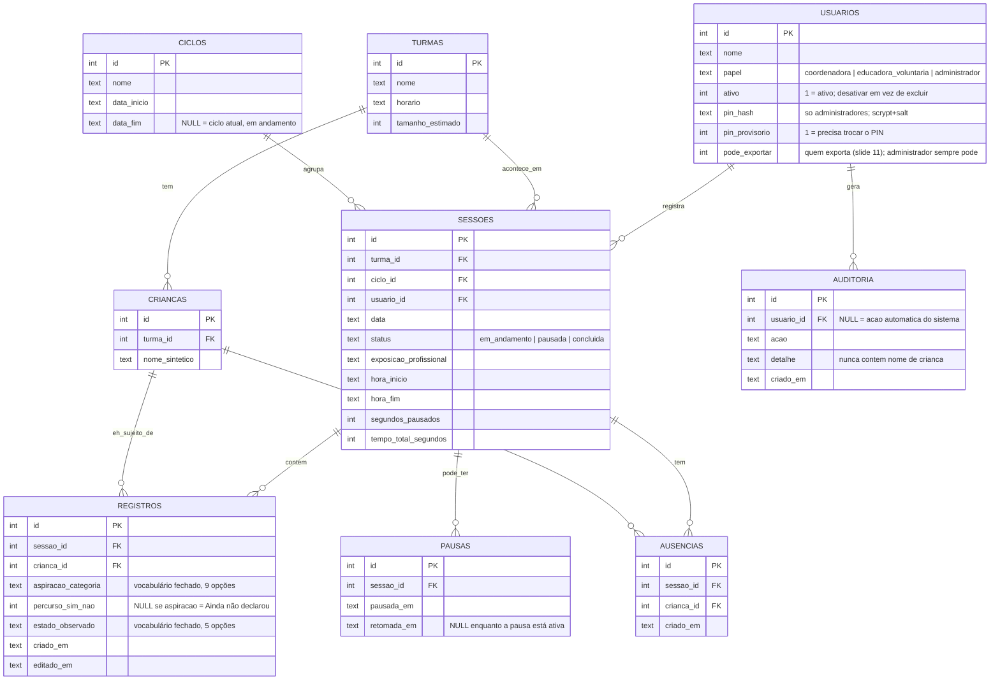

# Modelo de Dados — Registro do Laboratório de Sonhos

## Diagrama entidade-relacionamento

## Por que cada relacionamento existe

- **Turma → Crianças (1:N):** cada criança pertence a uma turma fixa; não existe matrícula cruzada neste MVP.
- **Turma + Ciclo → Sessões (N:1 cada):** uma sessão é "a oficina de um sábado específico, de uma turma específica, dentro de um ciclo". É o nível em que o tempo e a exposição do dia são medidos.
- **Sessão → Registros (1:N):** cada registro é a resposta de uma criança naquela sessão. A constraint `UNIQUE(sessao_id, crianca_id)` impede duplicar — editar é sempre `UPDATE`, nunca um segundo `INSERT`.
- **Usuário → Auditoria (1:N):** cada ação administrativa (login de administrador, criar/alterar pessoa, trocar PIN, encerrar ciclo, backup, exportação) vira uma linha. `usuario_id` fica `NULL` para ações do sistema (backup diário). O campo `detalhe` guarda só ids e nomes de equipe — **nunca nome de criança**.
- **Usuário.ativo / pin_hash / pin_provisorio:** `ativo` permite desativar sem apagar (sessões antigas continuam apontando para quem registrou). `pin_hash` só existe para administradores e guarda `salt:hash` (scrypt), nunca o PIN. `pin_provisorio = 1` faz a Administração exibir alerta até o PIN ser trocado.
- **Sessão → Ausências (1:N):** criança que **não veio** naquela sessão (`UNIQUE(sessao_id, crianca_id)`). Não é um registro (não tem aspiração). Existe para a pessoa poder **encerrar a sessão sem registrar todo mundo** e para a cobertura ser calculada só sobre quem estava presente (registradas ÷ (crianças − ausentes)). Registrar uma criança marcada como ausente remove a ausência.
- **Usuário.pode_exportar:** "Gestão de permissões (quem exporta)", slide 11 do pitch. Padrão: coordenadora 1, educadora 0; o administrador altera por pessoa e **sempre** pode exportar.
- **Registro.percurso_sim_nao / estado_observado:** ambos **opcionais**. `percurso_sim_nao` NULL = sem resposta (não é "não"); NULL também quando a aspiração é "Ainda não declarou".
- **Sessão → Pausas (1:N, informativa):** a tela atual não usa pausa; o tempo é o **tempo ativo** (ver `decisoes-tecnicas.md`). A tabela e as rotas continuam por compatibilidade.
- **Sessão → Pausas (1:N):** histórico de pausas, para sustentar o cálculo de `tempo_total_segundos` descontando o tempo parado (ver `decisoes-tecnicas.md`).
- **Criança → Registros (1:N, nunca exposto individualmente na UI):** é o que permite a série histórica por criança internamente, sem nunca violar a Regra 2 (nenhuma visão individual no painel) — a agregação acontece sempre por turma/ciclo, nunca por criança, nas rotas de leitura (`painel.js`, `exportacao.js`).

## Vocabulários fechados (aplicados via `CHECK` no SQLite, não só no front-end)

- `aspiracao_categoria`: 9 valores fixos, incluindo `Ainda não declarou`.
- `estado_observado`: 5 valores fixos — resposta ao pedido do professor sem abrir campo de texto livre (ver `decisoes-tecnicas.md`).
- `papel`: 3 valores (`coordenadora`, `educadora_voluntaria`, `administrador`).
- `status` (sessão): 3 valores.

Importante: o `CHECK` está no banco, não só validado no JavaScript — mesmo que alguém chame a API diretamente (sem passar pela interface), um valor fora do vocabulário é rejeitado pelo próprio SQLite.
